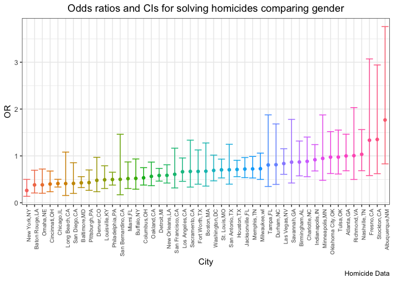

p8105_hw6_zc2610
================
Zuoqiao Cui
2022-11-22

``` r
library(tidyverse)
```

    ## ── Attaching packages ─────────────────────────────────────── tidyverse 1.3.2 ──
    ## ✔ ggplot2 3.3.6      ✔ purrr   0.3.5 
    ## ✔ tibble  3.1.8      ✔ dplyr   1.0.10
    ## ✔ tidyr   1.2.0      ✔ stringr 1.4.1 
    ## ✔ readr   2.1.2      ✔ forcats 0.5.2 
    ## ── Conflicts ────────────────────────────────────────── tidyverse_conflicts() ──
    ## ✖ dplyr::filter() masks stats::filter()
    ## ✖ dplyr::lag()    masks stats::lag()

``` r
library(modelr)
library(viridis)
```

    ## Loading required package: viridisLite

``` r
library(mgcv)
```

    ## Loading required package: nlme
    ## 
    ## Attaching package: 'nlme'
    ## 
    ## The following object is masked from 'package:dplyr':
    ## 
    ##     collapse
    ## 
    ## This is mgcv 1.8-40. For overview type 'help("mgcv-package")'.

# Problem 2

``` r
homicide_data_df = read_csv("./data/homicide-data.csv") %>% 
janitor::clean_names()
```

    ## Rows: 52179 Columns: 12
    ## ── Column specification ────────────────────────────────────────────────────────
    ## Delimiter: ","
    ## chr (9): uid, victim_last, victim_first, victim_race, victim_age, victim_sex...
    ## dbl (3): reported_date, lat, lon
    ## 
    ## ℹ Use `spec()` to retrieve the full column specification for this data.
    ## ℹ Specify the column types or set `show_col_types = FALSE` to quiet this message.

Create a new variable “city_state” to combine city and state columns

``` r
homicide_data_df = homicide_data_df %>% 
  mutate(
    city_state = str_c(city, state, sep = ",")
  ) %>% 
  select(-city,-state)
```

1.  Create a new binary variable indicating whether the homicide is
    solved (0 means “unsolved” and 1 means “solved”)

2.  Omit cities Dallas, TX; Phoenix, AZ; Kansas City, MO and Tulsa, AL

3.  Limit the analysis those for whom victim_race is white or black

4.  Be sure victim_age is numeric

``` r
homicide_data_df = homicide_data_df %>% 
  mutate(
    whether_solved = case_when(
      disposition == "Closed without arrest" ~ 0,
      disposition == "Open/No arrest" ~ 0,
      disposition == "Closed by arrest" ~ 1
    )
  ) %>% 
filter(
    city_state != "Dallas,TX" & city_state != "Phoenix,AZ" & city_state != "Kansas City,MO" & city_state != "Tulsa,AL"
  ) %>% 
    filter(victim_age != 'Unknown') %>% 
  mutate(victim_age = as.numeric(victim_age)) %>% 
  filter(victim_race == "White" | victim_race == "Black")
```

1.  For the city of Baltimore, MD, use the glm function to fit a
    logistic regression with resolved vs unresolved as the outcome and
    victim age, sex and race as predictors

2.  Save the output of glm as an R object

3.  Apply the broom::tidy to this object

``` r
homicide_Baltimore_df = homicide_data_df %>% 
  filter(city_state == 'Baltimore,MD') 
Baltimore_glm = glm(whether_solved ~ victim_age + victim_sex + victim_race,data = homicide_Baltimore_df, family = binomial()) %>% 
  broom::tidy()
```

1.  Obtain the estimate and confidence interval of the adjusted odds
    ratio for solving homicides

2.  Compare male victims to female victims keeping all other variables
    fixed

``` r
Baltimore_glm %>% 
  mutate(
    OR = exp(estimate),
    OR_lower = exp(estimate - std.error * 1.96),
    OR_upper = exp(estimate + std.error * 1.96)
        ) %>%
   select(term, log_OR = estimate, OR,OR_lower,OR_upper, p.value)
```

    ## # A tibble: 4 × 6
    ##   term               log_OR    OR OR_lower OR_upper  p.value
    ##   <chr>               <dbl> <dbl>    <dbl>    <dbl>    <dbl>
    ## 1 (Intercept)       0.310   1.36     0.975    1.91  7.04e- 2
    ## 2 victim_age       -0.00673 0.993    0.987    1.00  4.30e- 2
    ## 3 victim_sexMale   -0.854   0.426    0.325    0.558 6.26e-10
    ## 4 victim_raceWhite  0.842   2.32     1.65     3.27  1.45e- 6

``` r
fit_logistic_sex = Baltimore_glm %>%
  filter(term == "victim_sexMale") %>% 
  mutate(
    OR = exp(estimate),
    OR_lower = exp(estimate - std.error * 1.96),
    OR_upper = exp(estimate + std.error * 1.96)
        ) %>%
   select(term, log_OR = estimate, OR,OR_lower,OR_upper, p.value)
```

Answer:

1.  The estimate of the adjusted odds ratio for solving homicides
    comparing male victims to female victims is -0.8544628

2.  The confident interval is (0.324559,0.5578655)

3.  Run glm for each of the cities in the homicide dataset

4.  Obtain regression results

5.  Extract the adjusted odds ratio (and CI) for solving homicides

6.  Compare male victims to female victims only

``` r
fit_logistic_df = homicide_data_df %>% 
  select(victim_age,victim_race,victim_sex,city_state,whether_solved) %>% 
  nest(-city_state) %>% 
  mutate(
   models = map(.x = data, ~glm(whether_solved ~ victim_age + victim_sex + victim_race, family = binomial(link = logit), data = .x))
  ) %>% 
  mutate(
    results = map(models, broom::tidy)
  ) %>% 
  select(-data,-models) %>% 
  unnest(results) %>% 
   mutate(
    OR = exp(estimate),
    OR_lower = exp(estimate - std.error * 1.96),
    OR_upper = exp(estimate + std.error * 1.96)
        ) %>% 
  select(city_state,term,log_OR = estimate,OR,OR_lower,OR_upper)
```

    ## Warning: All elements of `...` must be named.
    ## Did you want `data = -city_state`?

``` r
fit_logistic_sex_df = fit_logistic_df %>% 
  filter(term == "victim_sexMale")
```

Create a plot that shows the estimated ORs and CIs for each city and
organize cities according to estimated OR

``` r
fit_logistic_sex_df %>% 
  mutate(city_state = fct_reorder(city_state, OR)) %>% 
  ggplot(aes(x = city_state, 
             y = OR, 
             ymin = OR_lower, 
             ymax = OR_upper,
             color = city_state
             )
  ) +
    geom_point() +
    geom_errorbar() +
    theme_bw() +
    labs(
      x = "City",
      y = "OR",
      title = "Odds ratios and CIs for solving homicides comparing gender",
      caption = "Homicide Data"
    ) +
  theme(axis.text.x = element_text(angle = 90, hjust = 1, size = rel(0.8)),plot.title = element_text(hjust = 0.5),legend.position = "none") 
```

<!-- -->

Comments:

1.  New York, NY has the lowest odds ratio.

2.  For cities whose OR is smaller than 1, males have lower odds
    compared to females. For cities whose OR is greater than 1, male has
    greater odds compared to female.

The confidence intervals of some cities (such as Chicago, JL) are narrow
so that we can be more confident about future predictions for these
cities.

# Problem 3

Import dataset

``` r
birthweight_df = read_csv("./data/birthweight.csv") %>% 
janitor::clean_names()
```

    ## Rows: 4342 Columns: 20
    ## ── Column specification ────────────────────────────────────────────────────────
    ## Delimiter: ","
    ## dbl (20): babysex, bhead, blength, bwt, delwt, fincome, frace, gaweeks, malf...
    ## 
    ## ℹ Use `spec()` to retrieve the full column specification for this data.
    ## ℹ Specify the column types or set `show_col_types = FALSE` to quiet this message.

Convert numeric to factor

``` r
birthweight_df = birthweight_df %>% 
 mutate(
    babysex = as.factor(babysex),
    frace = as.factor(frace),
    malform = as.factor(malform),
    mrace = as.factor(mrace)
  )
```

Check missing data

``` r
sum(!complete.cases(birthweight_df))
```

    ## [1] 0

Answer:

There is no missing data in this dataset
